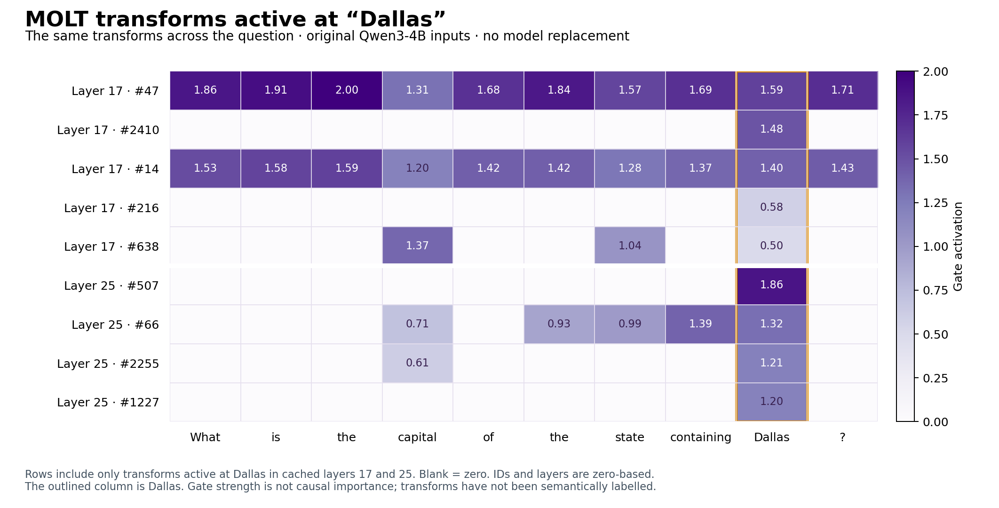

# MOLT gates at Dallas

Question: What is the capital of the state containing Dallas?

Original Qwen3-4B inputs. No MOLT or transcoder replacement and no intervention. Both cached MOLT layers evaluated with saved normalization. Primary results use FP32 MOLT arithmetic on BF16 original-model inputs.

| Layer | Transform | Rank | Gate at Dallas | Raw output contribution L2 | Peak gate token (whole prompt) |
|---|---|---|---|---|---|
| 17 | 47 | 512 | 1.5867 | 7.7099 | ` the` (position 20) |
| 17 | 2410 | 32 | 1.4797 | 2.6254 | ` Dallas` (position 26) |
| 17 | 14 | 512 | 1.3986 | 7.6145 | ` the` (position 20) |
| 17 | 216 | 256 | 0.5820 | 1.3853 | ` Dallas` (position 26) |
| 17 | 638 | 64 | 0.4992 | 1.1143 | ` capital` (position 21) |
| 25 | 507 | 128 | 1.8617 | 15.0251 | ` Dallas` (position 26) |
| 25 | 66 | 512 | 1.3219 | 13.1900 | ` containing` (position 25) |
| 25 | 2255 | 32 | 1.2104 | 6.8487 | ` Dallas` (position 26) |
| 25 | 1227 | 32 | 1.1981 | 10.4517 | ` Dallas` (position 26) |

Five transforms activate at Dallas in layer 17, four in layer 25, out of 2,480 per layer. BF16 and FP32 agree on the active transform IDs at Dallas. Summing the individual standardized output contributions reproduces Georg’s unchanged MOLT forward result with maximum absolute errors of 1.61e-6 (layer 17) and 1.55e-6 (layer 25).

Output contribution L2 is the vector norm after multiplying by the saved output standard deviation, excluding the shared output mean. It is not attribution to Austin, and vector norms are not additive because contributions can cancel.

The most active gate need not be the most selective for Dallas or the most causally important. These transform IDs have no semantic labels established by this experiment.

Only layers 17 and 25 were checked. No new MOLT weights were downloaded. The earlier 8.44 GB two-layer download took 508.55 seconds; future transfer times can vary.

Full per-token gates for these transforms: [gates.json](gates.json).
