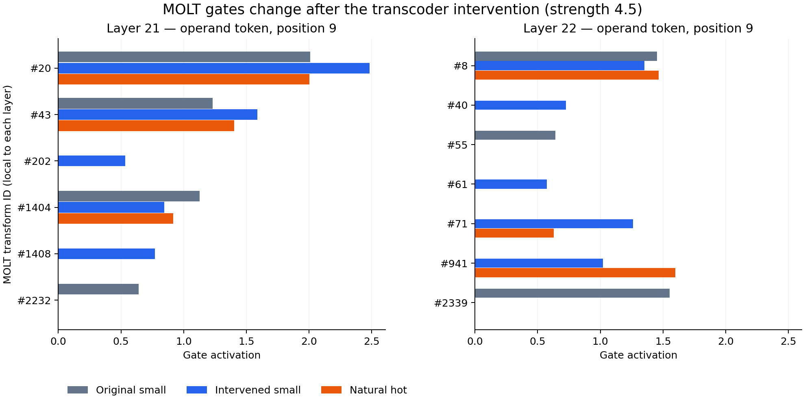
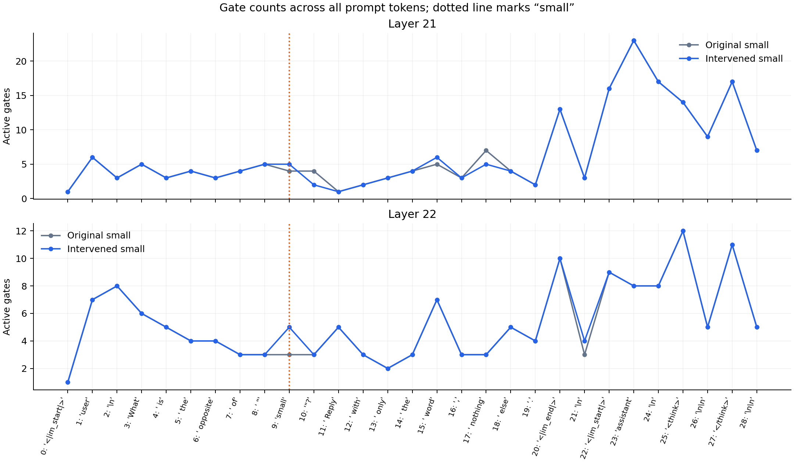

# MOLT gate comparison at layers 21 and 22

Completed on the existing RTX 5090. At the `small` token, the combined intervention changes layer 21 from 4 to 5 active gates and layer 22 from 3 to 5. The identities change as well as the counts. All indices are zero-based.

Recipient prompt: `What is the opposite of "small"? Reply with only the word, nothing else.`

Donor prompt: `What is the opposite of "hot"? Reply with only the word, nothing else.`

Strength is 4.5, with the same published feature selections as the successful reproduction. The recipient text never changes for the intervention conditions. Natural-hot is a separate untreated donor prompt.

## Gate counts and model readouts

Each layer has 2,480 possible gates. Position 9 is `small` in the recipient and `hot` in the donor; position 28 is the final chat-formatted prompt token, where the next answer token is predicted.

| Condition | L21 at operand | L22 at operand | L21 at final position | L22 at final position | Top next token | P(cold) |
|---|---:|---:|---:|---:|---|---:|
| Original small prompt | 4 | 3 | 7 | 5 | large | 1.86601e-10% |
| Suppress small only | 3 | 3 | 7 | 5 | negative | 0.125244% |
| Add hot only | 6 | 8 | 6 | 5 | large | 1.02809e-06% |
| Suppress small + add hot | 5 | 5 | 7 | 5 | cold | 99.774% |
| Natural hot prompt | 3 | 3 | 6 | 5 | cold | 97.7014% |

## Gates at the small token: baseline versus combined intervention

### Layer 21

Turned on: [202, 1408]. Turned off: [2232]. Shared active gates: [20, 43, 1404].

| Transform ID | Baseline gate | Intervened gate | Change |
|---|---:|---:|---:|
| 20 | 2.00922 | 2.48446 | +0.47524 |
| 43 | 1.23216 | 1.58781 | +0.35565 |
| 202 | 0.00000 | 0.53537 | +0.53537 |
| 1404 | 1.12892 | 0.84556 | -0.28336 |
| 1408 | 0.00000 | 0.77147 | +0.77147 |
| 2232 | 0.64088 | -0.00000 | -0.64088 |

### Layer 22

Turned on: [40, 61, 71, 941]. Turned off: [55, 2339]. Shared active gates: [8].

| Transform ID | Baseline gate | Intervened gate | Change |
|---|---:|---:|---:|
| 8 | 1.45388 | 1.35201 | -0.10187 |
| 40 | -0.00000 | 0.72725 | +0.72725 |
| 55 | 0.64142 | 0.00000 | -0.64142 |
| 61 | 0.00000 | 0.57329 | +0.57329 |
| 71 | 0.00000 | 1.26040 | +1.26040 |
| 941 | -0.00000 | 1.02009 | +1.02009 |
| 2339 | 1.55282 | -0.00000 | -1.55282 |

At the final prompt position, the combined intervention preserves all active gate identities in both layers (7 at layer 21; 5 at layer 22), although their strengths change.

In layer 22, gates #71 and #941 are off for the original small prompt but on for both the combined intervention and the natural hot prompt. The combined set contains extra gates #40 and #61 beyond the natural-hot set. This is a candidate correspondence, not evidence that these gates mean hot or cause the answer flip.

## What inputs were compared

We captured residual activations before post_attention_layernorm, matching Georg’s pre_norm MOLT checkpoint configuration. The original MLP itself receives the subsequent normalized activations. We applied the saved dimensionwise mean/std, encoder weights and bias, and Georg’s unchanged JumpReLU implementation. A gate is active exactly when its preactivation exceeds both its learned threshold and zero.

MOLTs were evaluated as passive observers; they did not replace MLPs in the model run. The existing intervention protocol freezes attention patterns across all layers and pins MLP outputs through layer 22 to original outputs plus decoder edits. Inputs at layer 21 reflect earlier-layer interventions; inputs at layer 22 additionally reflect the layer 21 edit. Neither reflects its own layer’s output edit.

Only gate behavior was requested and measured here. We did not download U/V transform matrices, reconstruct MLP outputs, or establish MOLT causal mediation or Jacobian fidelity. At strength 4.5, suppression uses signed decoder edits beyond zero; this is not simply turning features off.

## Verification and provenance

- The combined intervention reproduces the previous P(cold) exactly: 0.9977401494979858.
- The zero-delta control preserves logits and both layers’ captured inputs exactly.
- Removing interventions restores logits and captured inputs exactly.
- Primary gate computations use FP32 on BF16 model activations. BF16 autocast yields identical active sets at operand position 9 and final position 28 for every measured condition.
- Across all other positions, two marginal activity disagreements occur: one in layer 21 suppression-only and one in layer 22 combined. Full per-token sensitivity counts are in comparison.json.
- Downloaded 52,069,638 bytes (52.07 MB), comprising gate tensors, headers, and configs for both layers. Full checkpoints were not downloaded.
- Source range lengths and Content-Range headers were checked; extracted tensors are pinned to the checkpoint revision and hashed individually. These hashes document the downloaded subset; they are not a full-checkpoint hash verification.
- MOLT repository: georglange/qwen3-4b-molt, revision `eed10292a96521837f5d65b36fdfa3bf5bea0037`.
- Qwen model cached revision: `1cfa9a7208912126459214e8b04321603b3df60c`; transcoder revision: `94d176260ac39ce2f882b8b09aba8c118df29bb3`.
- Published intervention implementation: wdk0082/llm-circuits at `af8a37ad836dc401a0ec5dbb71307d8d7ab68028`.
- Runtime: {'torch': '2.11.0+cu128', 'transformers': '4.57.6', 'gpu': 'NVIDIA GeForce RTX 5090'}.

Artifacts: [full results](comparison.json), [all-token count table](counts-by-token.csv), captured-prenorm-inputs.pt, all-gates.pt, and gate-weights-manifest.json.
