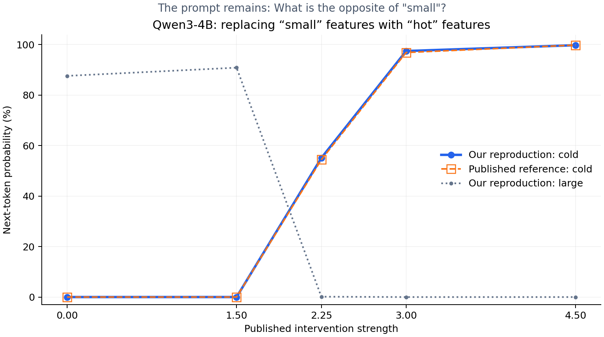

# Small-to-hot transcoder intervention: successful reproduction

The unchanged prompt's most probable next token flips from **large** to **cold** at strength 2.25, matching the published reference's first flip among the tested strengths. At strength 4.5, our P(cold) is 99.7740%, compared with 99.8224% in the reference. This is a close quantitative reproduction, not a bit-identical run.

Recipient prompt: `What is the opposite of "small"? Reply with only the word, nothing else.`

Donor prompt: `What is the opposite of "hot"? Reply with only the word, nothing else.`

No system message; thinking disabled; Qwen chat template; 29 tokens. Interventions at token index 9 (`small`), next-token readout at index 28. All layer and token indices are zero-based.

## Results

| Strength | Top next token | Our P(large) | Our P(cold) | Reference P(cold) |
|---|---|---|---|---|
| 0 | large | 87.6149% | 0.0000% | 0.0000% |
| 1.5 | large | 90.8698% | 0.0028% | 0.0025% |
| 2.25 | cold | 0.1366% | 55.0895% | 54.4135% |
| 3 | cold | 0.0000% | 97.4547% | 96.8658% |
| 4.5 | cold | 0.0000% | 99.7740% | 99.8224% |

## What was reproduced

The community [multilingual notebook](https://github.com/wdk0082/llm-circuits/blob/af8a37ad836dc401a0ec5dbb71307d8d7ab68028/notebooks/multilingual.ipynb), using its [selected feature groups](https://github.com/wdk0082/llm-circuits/blob/af8a37ad836dc401a0ec5dbb71307d8d7ab68028/notebooks/supernodes/multilingual_chat_4b.json) and [saved results](https://github.com/wdk0082/llm-circuits/blob/af8a37ad836dc401a0ec5dbb71307d8d7ab68028/artifacts/paper_multilingual/4b/operand_results_constrained.json). This is a community Qwen reproduction, not an Anthropic-released Qwen experiment.

We reused the upstream steering and frozen-attention functions verbatim, adapting weight access to only the 12 selected features across seven layers. We did not search for new features or tune strengths. Six small-associated feature directions are suppressed and six hot-associated directions are added at the same operand token.

The protocol freezes attention patterns to the recipient baseline across all 36 layers. It pins MLP outputs through layer 22 to clean outputs plus selected decoder deltas; layers 23–35 recompute their MLP outputs. Attention value/output computations still respond. RMSNorm is not frozen in this configuration. This is an intervention on original MLP outputs using transcoder directions, not wholesale transcoder replacement.

For strength s, the small feature target is (1-s) times its clean activation; the hot feature target is s times its published donor activation. At strengths above 1, small targets become negative: these are signed decoder-direction interventions, not naturally occurring ReLU activations.

We encoded selected features on captured original MLP inputs, rather than loading the full replacement model with reconstruction-error addback. Our donor activations were measured as a check; the intervention uses the published stored donor values. Numerical differences are visible in baseline logits and some feature activations. We have not isolated their cause.

## Controls and resources

- Correct untreated baselines: recipient top token `large`; donor top token `cold` (97.7014%).
- Frozen-attention/MLP-pinning control with zero intervention: maximum absolute logit difference **0.0**.
- After removing all intervention hooks: maximum absolute logit difference from original baseline **0.0**.
- Only about **2.9 MB** downloaded for selected transcoder weights and metadata; no full transcoder layers or additional MOLTs.
- Peak PyTorch allocated GPU memory: **7.625 GiB** (does not include every GPU allocation).
- Local/remote result SHA-256 verified: `fd5f3a6fa493629563c27f8664f706b94f8fe61abb1e8c2caa69228a0ce63092`.

## Selected features

| Group | Layer | Feature ID | Our small-prompt activation | Our hot-prompt activation | Published group activation |
|---|---|---|---|---|---|
| small (multilingual) | 22 | 113890 | 9.75000 | 0.00000 | 9.68750 |
| small (multilingual) | 22 | 42644 | 5.96875 | 0.00000 | 6.00000 |
| small (multilingual) | 0 | 133356 | 5.96875 | 0.00000 | 5.96880 |
| small (multilingual) | 22 | 38866 | 5.59375 | 0.00000 | 5.62500 |
| small (multilingual) | 21 | 120516 | 5.46875 | 0.00000 | 5.46880 |
| small (multilingual) | 19 | 77492 | 4.18750 | 0.00000 | 4.15620 |
| hot (multilingual) | 5 | 134029 | 0.00000 | 4.68750 | 4.71880 |
| hot (multilingual) | 4 | 32249 | 0.00000 | 3.23438 | 3.23440 |
| hot (multilingual) | 3 | 75392 | 0.00000 | 3.06250 | 3.06250 |
| hot (multilingual) | 5 | 18203 | 0.00000 | 2.96875 | 2.98440 |
| hot (multilingual) | 3 | 131394 | 0.00000 | 2.81250 | 2.81250 |
| hot (multilingual) | 5 | 51825 | 0.00000 | 2.17188 | 2.15620 |

## Provenance and limits

Model: Qwen/Qwen3-4B; cached revision `1cfa9a7208912126459214e8b04321603b3df60c`.
Transcoders: mwhanna/qwen3-4b-transcoders, revision `94d176260ac39ce2f882b8b09aba8c118df29bb3`.
Intervention source revision: `af8a37ad836dc401a0ec5dbb71307d8d7ab68028`.
Runtime: {'python': '3.12.14', 'torch': '2.11.0+cu128', 'transformers': '4.57.6', 'gpu': 'NVIDIA GeForce RTX 5090'}; BF16 model/weights, eager attention.

This measures next-token probabilities for one English prompt, not unrestricted multi-token generation, multilingual generalization, or a multi-hop geography task. It establishes the feature-group intervention's effect under the stated constraints, not unique causal necessity of every selected feature. No equivalent MOLT intervention or MOLT Jacobian validation has been run here.

Raw output: [reproduction.json](reproduction.json). The nested protocol.status field is preserved archival text from the pre-run recipe; the completed runs and controls above establish the current successful status. Selected weight hashes and source-function hashes are recorded in weights-manifest.json and source-functions.json.
