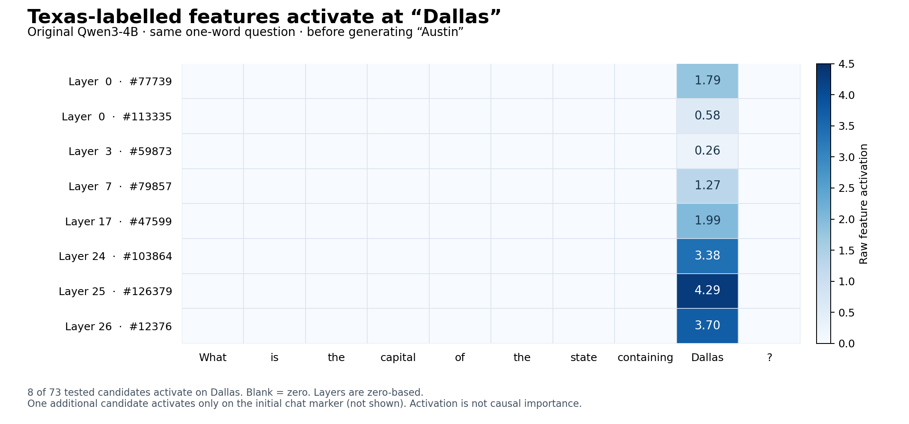

# Texas-labelled transcoder features on the Dallas prompt

Question: What is the capital of the state containing Dallas?

System instruction: Answer with exactly one word. Do not explain.

The original Qwen3-4B predicts Austin. No MOLT replacement, transcoder replacement, or intervention was applied.

## Result

73 unique exact Texas labels were selected from the first 80 semantic-search results across all 36 layers. Search pagination returned duplicates; this candidate set covers 25 layers and is not exhaustive. Eight candidates activate at Dallas (full prompt token index 26), and nowhere else in the 37-token prompt. A ninth candidate activates only at the initial chat marker. The other 64 candidates are zero everywhere.

| Layer (zero-based) | Feature | Active token | FP32 activation |
|---|---|---|---|
| 0 | [#77739](https://www.neuronpedia.org/qwen3-4b/0-transcoder-hp/77739) | ` Dallas` (position 26) | 1.792086 |
| 0 | [#113335](https://www.neuronpedia.org/qwen3-4b/0-transcoder-hp/113335) | ` Dallas` (position 26) | 0.575240 |
| 3 | [#59873](https://www.neuronpedia.org/qwen3-4b/3-transcoder-hp/59873) | ` Dallas` (position 26) | 0.262701 |
| 6 | [#116705](https://www.neuronpedia.org/qwen3-4b/6-transcoder-hp/116705) | `<|im_start|>` (position 0) | 0.246244 |
| 7 | [#79857](https://www.neuronpedia.org/qwen3-4b/7-transcoder-hp/79857) | ` Dallas` (position 26) | 1.274674 |
| 17 | [#47599](https://www.neuronpedia.org/qwen3-4b/17-transcoder-hp/47599) | ` Dallas` (position 26) | 1.993972 |
| 24 | [#103864](https://www.neuronpedia.org/qwen3-4b/24-transcoder-hp/103864) | ` Dallas` (position 26) | 3.375591 |
| 25 | [#126379](https://www.neuronpedia.org/qwen3-4b/25-transcoder-hp/126379) | ` Dallas` (position 26) | 4.294876 |
| 26 | [#12376](https://www.neuronpedia.org/qwen3-4b/26-transcoder-hp/12376) | ` Dallas` (position 26) | 3.696133 |

## Measurement details

- Release: mwhanna/qwen3-4b-transcoders at revision 94d176260ac39ce2f882b8b09aba8c118df29bb3.
- Input hook: each original MLP input, after post_attention_layernorm, matching mlp.hook_in.
- Encoder: ReLU(W_enc x + b_enc), matching circuit-tracer SingleLayerTranscoder.encode. These ReLU features are independent, so only selected encoder rows and biases are needed.
- Original model and checkpoint tensors: BF16; primary encoder arithmetic: FP32. The BF16 encoder check produced exactly the same active/inactive pattern for every tested feature and token.
- Captured prompt token IDs exactly match the prior one-word Dallas test; the next predicted token is still Austin.
- All 37 positions were evaluated, including system and assistant-format tokens. The figure shows only question tokens. The generated answer was not fed into this measurement.
- Approximately 10.2 MB fetched, including file headers and full small bias arrays. No full transcoder layer downloaded.
- Labels are automated Gemini 2.0 Flash descriptions. They are candidates for interpretation, not verified causal functions.
- A positive activation at Dallas does not establish a Dallas → Texas → Austin causal pathway. No attribution, ablation, intervention, or Jacobian test was performed here.

Full activations, including all zero candidates and BF16 checks: [activations.json](activations.json).
